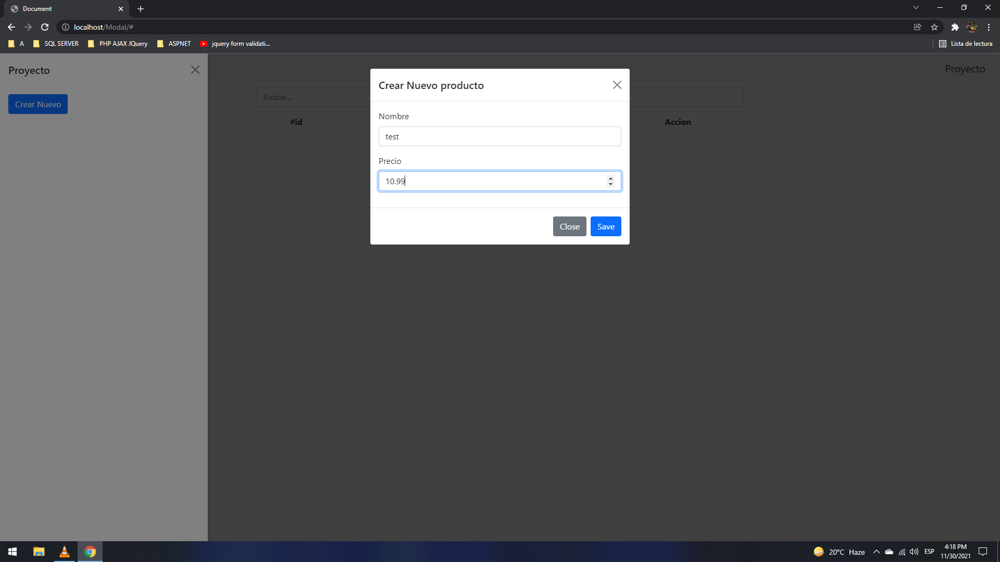
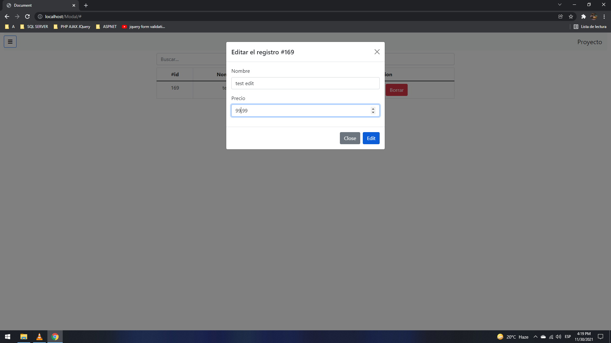
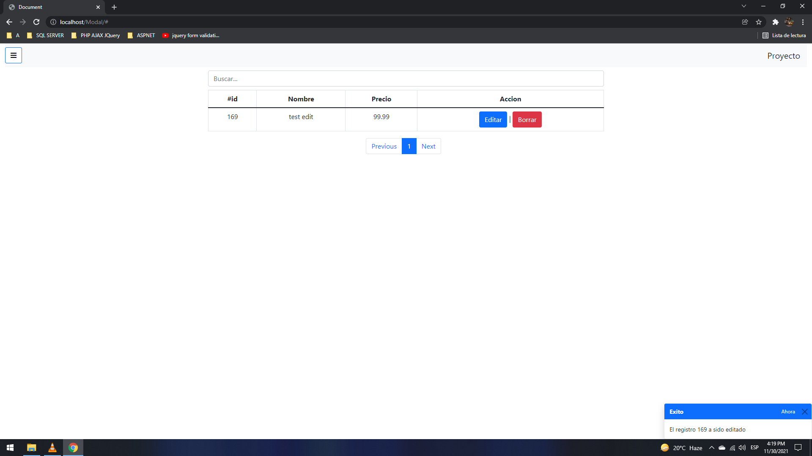
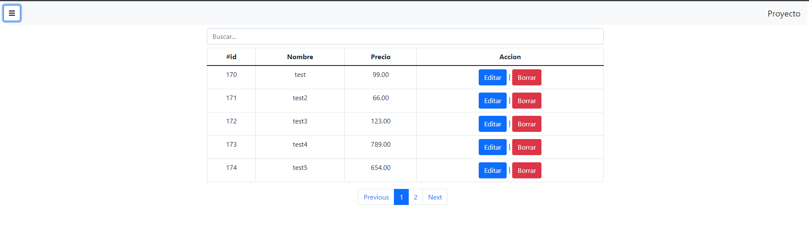

# modal-crud-ajax-php
Crud con PHP Y Ajax usando tecnicas de bootstrap tales como: modal, offcanvas, toast y paginacion
1. creacion de nuevo registro

2. Edicion de un registro

3. Eliminacion de un registro

4. Paginacion

